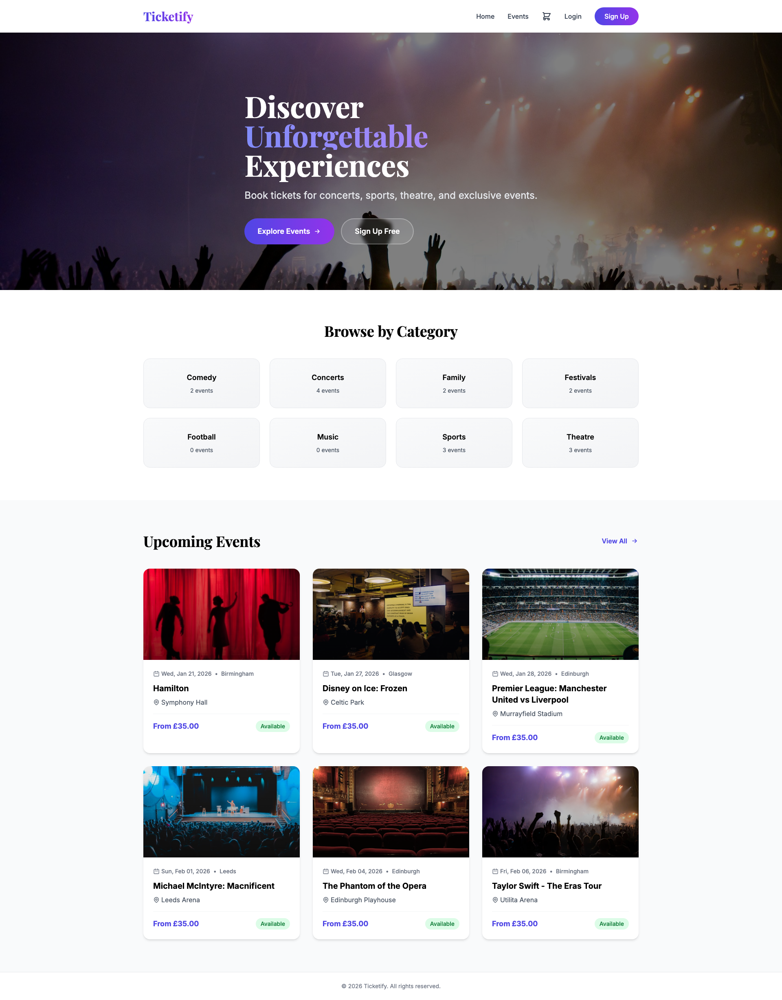
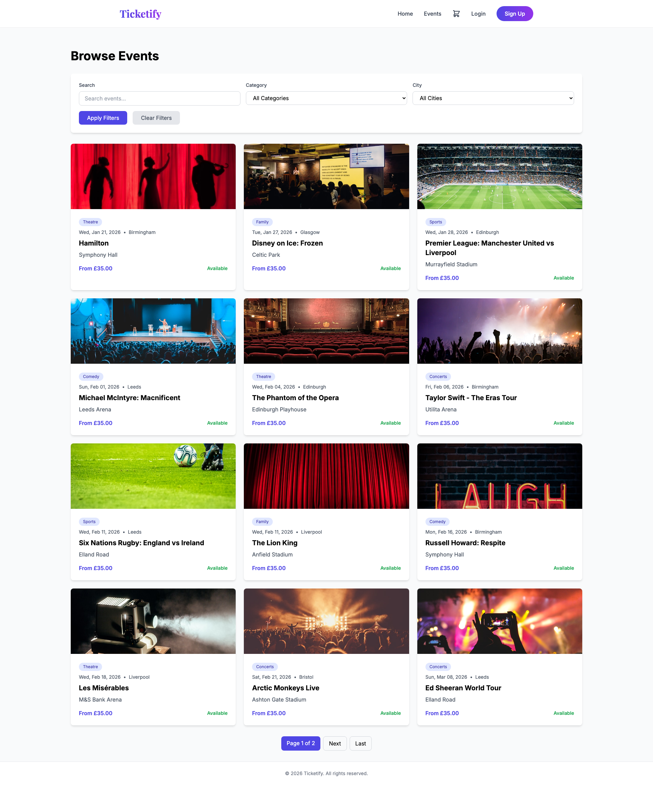
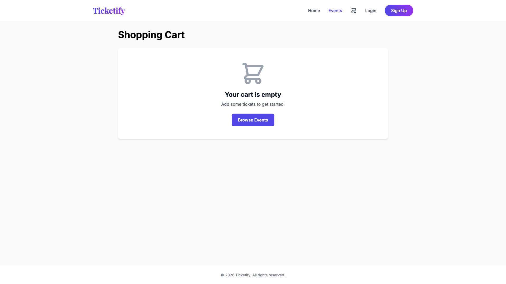
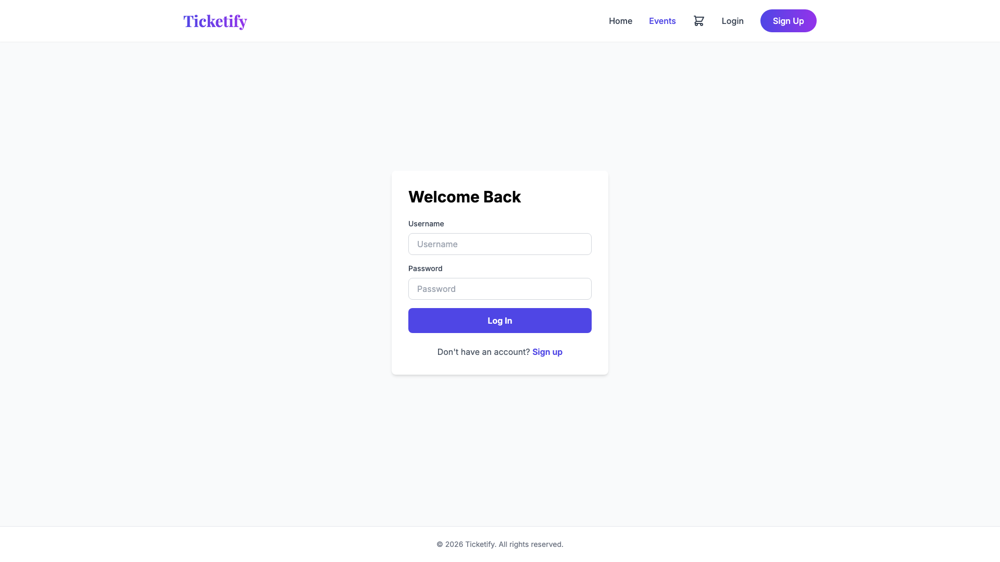
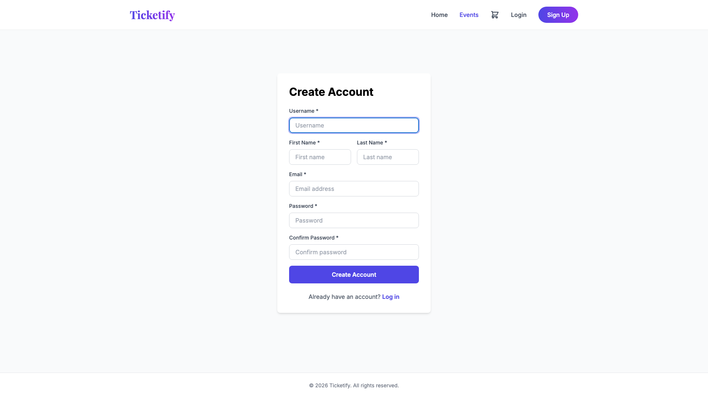
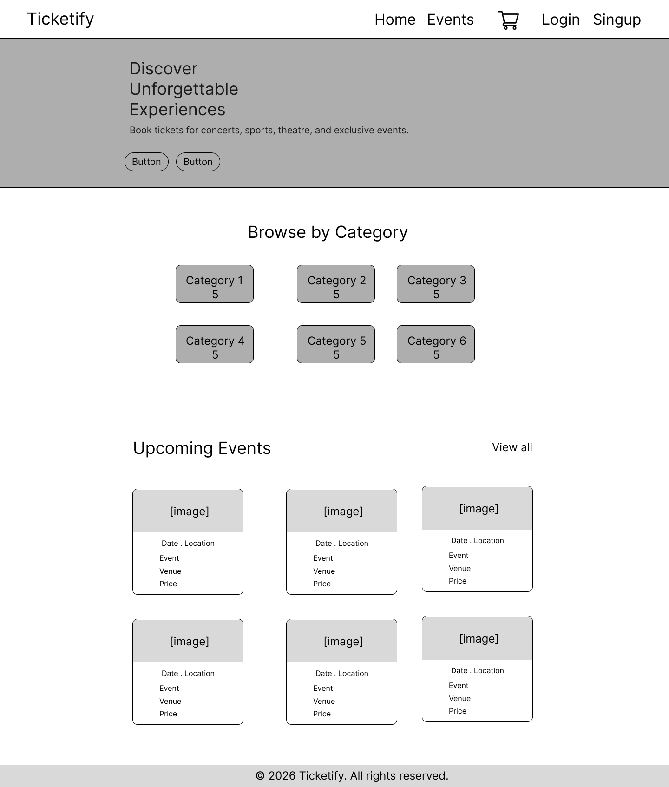
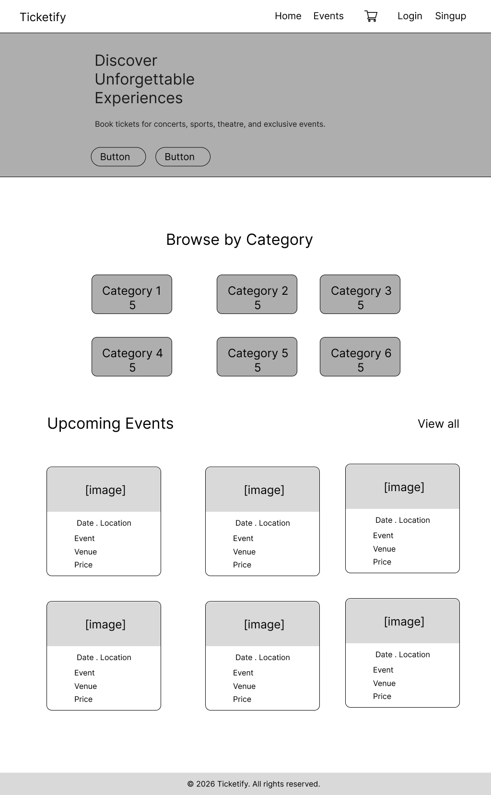
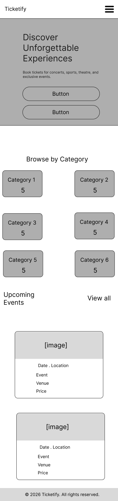
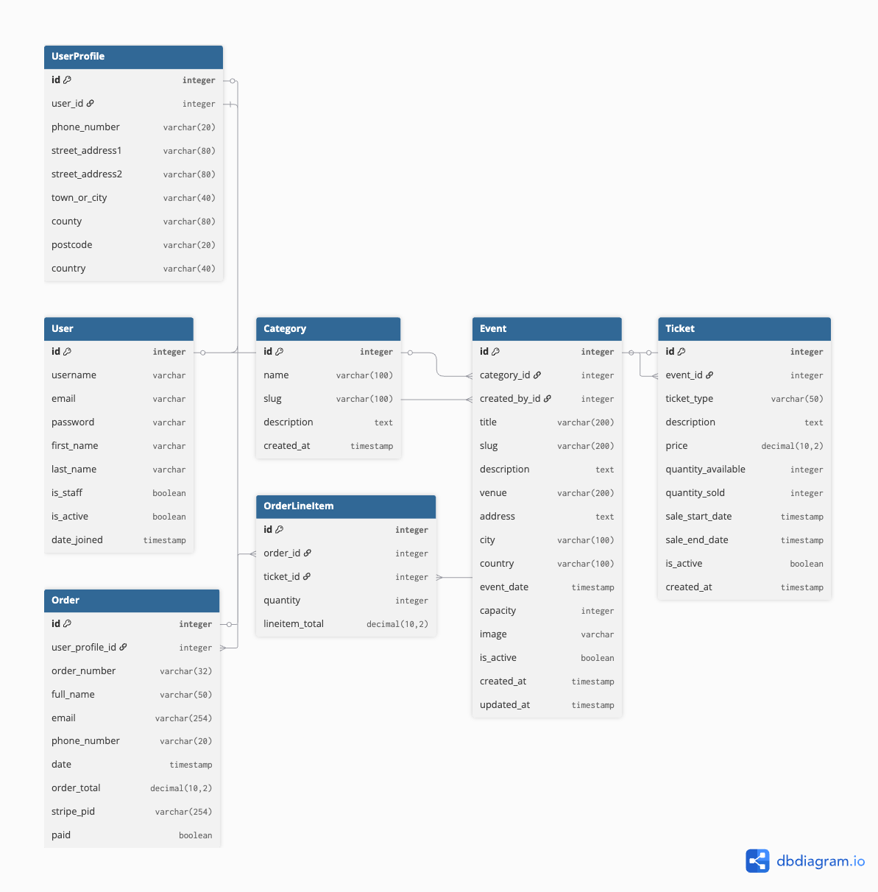

# Ticketify - Event Ticketing Platform


A professional, full-stack event ticketing platform built with Django that enables users to browse upcoming events, securely purchase tickets using Stripe, and manage their bookings. Event organizers can create and manage events, track sales, and monitor venue capacity through an intuitive admin interface.

**Live Site:** [https://ticketify-ce5e7cf176b4.herokuapp.com/](https://ticketify-ce5e7cf176b4.herokuapp.com/)

---

## Table of Contents

- [Project Rationale](#project-rationale)
- [User Experience (UX)](#user-experience-ux)
  - [User Stories](#user-stories)
  - [Design Decisions](#design-decisions)
  - [Wireframes](#wireframes)
  - [Color Scheme](#color-scheme)
  - [Typography](#typography)
- [Features](#features)
  - [Existing Features](#existing-features)
  - [Future Enhancements](#future-enhancements)
- [Database Design](#database-design)
  - [Entity Relationship Diagram](#entity-relationship-diagram)
  - [Data Models](#data-models)
  - [Design Rationale](#design-rationale)
- [Technologies Used](#technologies-used)
- [Testing](#testing)
  - [Automated Testing](#automated-testing)
  - [Manual Testing](#manual-testing)
  - [Code Validation](#code-validation)
  - [Browser Compatibility](#browser-compatibility)
  - [Accessibility](#accessibility)
  - [Known Bugs](#known-bugs)
- [Deployment](#deployment)
  - [Local Deployment](#local-deployment)
  - [Heroku Deployment](#heroku-deployment)
  - [Environment Variables](#environment-variables)
- [Security Features](#security-features)
- [Credits](#credits)
- [Acknowledgments](#acknowledgments)

## Project Rationale

### The Problem

Finding and purchasing event tickets can be frustrating. Users face:
- Scattered information across multiple platforms
- Unclear availability and pricing
- Complicated checkout processes
- Concerns about payment security
- Difficulty tracking past purchases

### The Solution

Ticketify addresses these pain points by providing:
- **Centralized Event Discovery**: All events in one place with powerful search and filtering
- **Real-Time Availability**: Instant ticket availability updates to prevent overbooking
- **Streamlined Checkout**: Simple, secure purchase flow with Stripe integration
- **Order Management**: Easy access to purchase history and order details
- **Venue Capacity Control**: Automated tracking prevents selling beyond venue limits

### Project Goals

1. **User-Centric Design**: Create an intuitive interface that makes finding and purchasing tickets effortless
2. **Security First**: Implement industry-standard payment processing and data protection
3. **Scalability**: Build a robust database structure that can grow with demand
4. **Admin Efficiency**: Provide event organizers with easy-to-use management tools
5. **Mobile Accessibility**: Ensure full functionality across all devices

### Target Audience

**Primary Users:**
- Event attendees looking for concerts, sports, theater, and other live events
- Age range: 18-55
- Comfortable with online transactions
- Mobile-first users

**Secondary Users:**
- Event organizers and venue managers
- Need quick event creation and sales tracking
- Require capacity management tools

## Features

### Implemented Features

#### User Authentication
- User registration with email validation
- Secure login/logout functionality
- User profile management
- Order history tracking

#### Event Management
- Browse all upcoming events
- Search events by title or description
- Filter by category (Music, Sports, Arts, Comedy, etc.)
- Filter by city/location
- View detailed event information including:
  - Event date, time, and venue
  - Ticket types and pricing
  - Venue capacity and availability
  - Event description and location details

#### Shopping Cart
- Session-based cart functionality
- Add/remove tickets
- Update ticket quantities
- Real-time availability validation
- Cart persistence across sessions

#### Payment Processing
- Secure Stripe payment integration
- Multiple ticket type support (Standard, VIP, Early Bird)
- Payment confirmation
- Order tracking with unique order numbers
- Webhook integration for payment verification

#### Responsive Design
- Mobile-first approach using Tailwind CSS
- Clean, professional interface
- Intuitive navigation
- Accessible design patterns

### Application Screenshots

#### Homepage


#### Events List


#### Event Detail


#### Shopping Cart


#### User Authentication



### Future Features

- Email notifications for order confirmations
- QR code ticket generation
- Event organizer dashboard
- Ticket transfer functionality
- Reviews and ratings system
- Recurring events support
- Multiple payment methods
- Wishlist functionality

## User Experience (UX)

### User Stories

#### As a First-Time Visitor

1. **Event Discovery**
   - As a visitor, I want to immediately see what events are available so I can find something interesting
   - **Acceptance Criteria**: Homepage displays featured/upcoming events with images and key details
   - **Implementation**: Event list view on homepage with filtering options

2. **Search Functionality**
   - As a visitor, I want to search for specific events so I can quickly find what I'm looking for
   - **Acceptance Criteria**: Search bar prominently displayed, searches event titles and descriptions
   - **Implementation**: Django query filter on Event model

3. **Event Details**
   - As a visitor, I want to see comprehensive event information so I can decide if I want to attend
   - **Acceptance Criteria**: Event page shows date, time, venue, description, ticket options, and availability
   - **Implementation**: Event detail view with all related ticket types

#### As a Registered User

4. **Account Creation**
   - As a new user, I want to create an account so I can save my information and track orders
   - **Acceptance Criteria**: Registration form with validation, auto-login after registration
   - **Implementation**: Django authentication system with custom registration view

5. **Ticket Purchase**
   - As a user, I want to securely purchase tickets so I can attend events
   - **Acceptance Criteria**: Add tickets to cart, proceed through checkout, pay via Stripe
   - **Implementation**: Shopping cart session, Stripe payment integration

6. **Order History**
   - As a user, I want to view my past orders so I can track my ticket purchases
   - **Acceptance Criteria**: Profile page displays all previous orders with details
   - **Implementation**: Order model linked to User, profile view queries user's orders

7. **Profile Management**
   - As a user, I want to update my profile information so my details are current
   - **Acceptance Criteria**: Editable profile form with validation
   - **Implementation**: UserProfile model with update view

#### As an Event Organizer (Admin)

8. **Event Management**
   - As an organizer, I want to create and manage events so I can sell tickets
   - **Acceptance Criteria**: Admin panel allows CRUD operations on events
   - **Implementation**: Django admin interface customized for Event model

9. **Ticket Configuration**
   - As an organizer, I want to set different ticket types and prices so I can offer various options
   - **Acceptance Criteria**: Ability to add multiple ticket types per event with individual pricing
   - **Implementation**: Ticket model with ForeignKey to Event

10. **Sales Tracking**
    - As an organizer, I want to monitor ticket sales so I can track performance
    - **Acceptance Criteria**: Admin panel shows quantity sold vs. available for each ticket type
    - **Implementation**: Ticket model with quantity_sold field, admin list display

### Design Decisions

#### Visual Design Philosophy

The design emphasizes **clarity and simplicity** over complexity. Every element serves a purpose:

1. **Clean Layout**: Generous white space prevents cognitive overload
2. **Visual Hierarchy**: Size and color guide users to important actions
3. **Consistent Patterns**: Similar actions look similar across the site
4. **Progressive Disclosure**: Information revealed as needed, not all at once

#### Color Scheme


**Primary Palette:**
- **Indigo (#4F46E5)**: Trust, professionalism, call-to-action buttons
- **Purple Gradients (#9333EA - #C084FC)**: Visual interest, premium feel
- **Neutral Grays**: Text, borders, backgrounds for readability

**Functional Colors:**
- **Green (#10B981)**: Success messages, confirmation states
- **Red (#EF4444)**: Errors, warnings, sold-out indicators
- **Yellow (#F59E0B)**: Informational alerts

**Why These Colors:**
- Indigo/purple combination is uncommon in ticketing, making Ticketify distinctive
- High contrast ratios ensure WCAG AAA accessibility compliance
- Warm neutrals prevent stark, clinical appearance

#### Typography

**Font Stack:**
```css
font-family: -apple-system, BlinkMacSystemFont, 'Segoe UI', Roboto, 'Helvetica Neue', Arial, sans-serif;
```

**Type Scale:**
- Headings: 2.25rem (36px) → 0.875rem (14px)
- Body: 1rem (16px) base size
- Small text: 0.875rem (14px) for metadata

**Why System Fonts:**
- Zero latency - no font download required
- Native look and feel on each platform
- Excellent legibility across devices

#### Layout & Navigation

**Navigation Structure:**
```
┌─────────────────────────────────────────┐
│  Logo    Events   Cart (2)   Login      │
└─────────────────────────────────────────┘
│                                         │
│          Main Content Area              │
│                                         │
└─────────────────────────────────────────┘
│         Footer Links                    │
└─────────────────────────────────────────┘
```

**Mobile Navigation:**
- Hamburger menu for space efficiency
- Cart indicator always visible
- Touch-friendly button sizes (min 44x44px)

#### User Flows

**Primary Flow: Browsing to Purchase**
```
Homepage
   ↓
Browse Events (with filters)
   ↓
Event Detail Page
   ↓
Add to Cart
   ↓
Shopping Cart Review
   ↓
Checkout (Billing Info)
   ↓
Payment (Stripe)
   ↓
Order Confirmation
```

**Supporting Flow: Account Management**
```
Register/Login
   ↓
User Profile
   ├→ View Orders
   ├→ Update Info
   └→ Logout
```

### Wireframes

Wireframes were created to plan the user interface and demonstrate responsive layouts across desktop, tablet, and mobile devices.

**Desktop View**



**Tablet View**



**Mobile View**



### Accessibility Considerations

Ticketify implements WCAG 2.1 Level AA standards:

**Semantic HTML:**
- Proper heading hierarchy (h1 → h6)
- Semantic elements (`<nav>`, `<main>`, `<article>`, `<footer>`)
- Form labels associated with inputs
- Alt text for all images

**Keyboard Navigation:**
- All interactive elements accessible via Tab
- Logical tab order follows visual flow
- Focus indicators clearly visible
- Skip-to-content link for screen readers

**Color & Contrast:**
- Text contrast ratio ≥ 4.5:1 (WCAG AA)
- Important elements ≥ 7:1 (WCAG AAA)
- Color never the sole means of conveying information

**Screen Reader Support:**
- ARIA labels where needed
- Form validation errors announced
- Dynamic content updates announced
- Loading states communicated

**Responsive Design:**
- Mobile-first approach
- Touch targets ≥ 44x44px
- Text remains readable without zoom up to 200%
- No horizontal scrolling required

## Technologies Used

### Backend
- **Django 6.0.1** - Python web framework
- **Python 3.x** - Programming language
- **PostgreSQL** - Production database (via Neon)
- **SQLite** - Development database
- **Stripe 14.1.0** - Payment processing

### Frontend
- **Tailwind CSS 3.4.1** - Utility-first CSS framework
- **HTML5** - Markup language
- **JavaScript** - Client-side interactivity

### Dependencies
- **gunicorn** - WSGI HTTP server
- **whitenoise** - Static file serving
- **python-decouple** - Environment variable management
- **dj-database-url** - Database configuration
- **psycopg2-binary** - PostgreSQL adapter
- **Pillow** - Image processing

### Development Tools
- **Git** - Version control
- **npm** - Package management for Tailwind
- **VS Code** - Code editor

## Database Design

The application uses a relational database with carefully designed models to manage events, tickets, orders, and user profiles. The database structure ensures data integrity, prevents overbooking, and supports complex querying for event discovery and sales tracking.

### Entity Relationship Diagram



### Data Models

#### 1. Category

**Purpose:** Organize events into categories (e.g., Music, Sports, Theater, Conference)

| Field | Type | Constraints |
|-------|------|-------------|
| id | AutoField | Primary Key |
| name | CharField(100) | Unique, Required |
| slug | SlugField(100) | Unique, Auto-generated |
| description | TextField | Optional |
| created_at | DateTimeField | Auto-generated |

**Relationships:**
- One Category can have Many Events

**Business Logic:**
- Slug automatically generated from name for clean URLs
- Categories ordered alphabetically for consistent display

---

#### 2. Event

**Purpose:** Store event information that users can buy tickets for

| Field | Type | Constraints |
|-------|------|-------------|
| id | AutoField | Primary Key |
| category | ForeignKey(Category) | On Delete: SET_NULL, null=True |
| title | CharField(200) | Required |
| slug | SlugField(200) | Unique, Auto-generated |
| description | TextField | Required |
| venue | CharField(200) | Required |
| address | TextField | Required |
| city | CharField(100) | Required |
| country | CharField(100) | Default='Ireland' |
| event_date | DateTimeField | Required |
| capacity | PositiveIntegerField | Default=1000 |
| image | ImageField | Optional, Cloudinary storage |
| is_active | BooleanField | Default=True |
| created_by | ForeignKey(User) | On Delete: SET_NULL, null=True |
| created_at | DateTimeField | Auto-generated |
| updated_at | DateTimeField | Auto-updated |

**Relationships:**
- Many Events belong to One Category
- One Event can have Many Tickets

**Computed Properties:**
- `is_past`: Check if event has already occurred
- `total_tickets_sold`: Calculate total tickets sold across all ticket types
- `total_tickets_available`: Calculate remaining tickets across all active ticket types
- `has_available_tickets`: Check if any tickets are available
- `capacity_percentage`: Calculate percentage of venue capacity sold
- `is_at_capacity`: Check if event has reached venue capacity
- `min_price`: Get the minimum ticket price

**Business Logic:**
- Slug automatically generated from title with uniqueness handling
- Event date must be in the future (validation in clean() method)
- Events ordered by event_date for chronological display
- Database indexes on event_date and slug for query optimization

---

#### 3. Ticket

**Purpose:** Define ticket types for events with pricing and availability

| Field | Type | Constraints |
|-------|------|-------------|
| id | AutoField | Primary Key |
| event | ForeignKey(Event) | On Delete: CASCADE, related_name='tickets' |
| ticket_type | CharField(50) | Choices: General, VIP, Early Bird, Student |
| description | TextField | Optional |
| price | DecimalField | Max Digits=10, Decimal Places=2 |
| quantity_available | PositiveIntegerField | Required |
| quantity_sold | PositiveIntegerField | Default=0 |
| sale_start_date | DateTimeField | Optional |
| sale_end_date | DateTimeField | Optional |
| is_active | BooleanField | Default=True |
| created_at | DateTimeField | Auto-generated |

**Computed Properties:**
- `quantity_remaining`: quantity_available - quantity_sold
- `is_sold_out`: Check if all tickets are sold
- `percentage_sold`: Calculate percentage of tickets sold
- `is_available`: Check if tickets are available and within sale dates

**Relationships:**
- Many Tickets belong to One Event
- One Ticket type can be in Many OrderLineItems

**Business Logic:**
- Price must be non-negative
- Quantity available must be positive
- Tickets ordered by price for consistent display
- Quantity sold updated automatically when orders are placed

---

#### 4. UserProfile

**Purpose:** Extend Django User model with additional profile information

| Field | Type | Constraints |
|-------|------|-------------|
| id | AutoField | Primary Key |
| user | OneToOneField(User) | On Delete: CASCADE |
| phone_number | CharField(20) | Optional |
| street_address1 | CharField(80) | Optional |
| street_address2 | CharField(80) | Optional |
| town_or_city | CharField(40) | Optional |
| county | CharField(80) | Optional |
| postcode | CharField(20) | Optional |
| country | CharField(40) | Optional |

**Relationships:**
- One UserProfile belongs to One User

**Business Logic:**
- Profile automatically created when user registers (via Django signals)
- Profile deleted when user is deleted (cascade)
- Stores default billing information for faster checkout

---

#### 5. Order

**Purpose:** Store order information when users purchase tickets

| Field | Type | Constraints |
|-------|------|-------------|
| id | AutoField | Primary Key |
| order_number | CharField(32) | Unique, Auto-generated UUID |
| user_profile | ForeignKey(UserProfile) | On Delete: SET_NULL, null=True |
| full_name | CharField(50) | Required |
| email | EmailField(254) | Required |
| phone_number | CharField(20) | Required |
| date | DateTimeField | Auto-generated |
| order_total | DecimalField | Max Digits=10, Decimal Places=2 |
| stripe_pid | CharField(254) | Required, Unique |
| paid | BooleanField | Default=False |

**Relationships:**
- Many Orders can belong to One UserProfile
- One Order can have Many OrderLineItems

**Business Logic:**
- Order number generated as UUID for uniqueness and security
- Stripe payment intent ID stored for reconciliation
- Order total calculated from sum of line items
- Orders ordered by date (descending) for recent-first display
- Payment status tracked via Stripe webhooks

---

#### 6. OrderLineItem

**Purpose:** Individual line items within an order (tickets purchased)

| Field | Type | Constraints |
|-------|------|-------------|
| id | AutoField | Primary Key |
| order | ForeignKey(Order) | On Delete: CASCADE, related_name='lineitems' |
| ticket | ForeignKey(Ticket) | On Delete: CASCADE |
| quantity | PositiveIntegerField | Required, Default=1 |
| lineitem_total | DecimalField | Max Digits=10, Decimal Places=2 |

**Relationships:**
- Many OrderLineItems belong to One Order
- Many OrderLineItems can reference One Ticket type

**Business Logic:**
- Line item total calculated as ticket.price * quantity
- Ticket quantity_sold incremented when line item is saved
- Quantity must not exceed ticket.quantity_remaining
- Line items deleted when order is deleted (cascade)

---

### Design Rationale

#### Why These Models?

**Separation of Ticket and Event:**
- Events can have multiple ticket types (VIP, General, Early Bird)
- Each ticket type has independent pricing and availability
- Allows flexible pricing strategies (early bird discounts, tiered pricing)

**UserProfile Extension:**
- Keeps auth-related data in Django's User model
- Extends with business-specific fields
- Allows easy integration with Django's authentication system

**Order and OrderLineItem Split:**
- Follows e-commerce best practices
- Order contains billing information and totals
- Line items track individual ticket purchases
- Supports multiple ticket types in one order

**UUID for Order Numbers:**
- Non-sequential for security (prevents guessing)
- Unique across distributed systems
- Safe for public display

#### Database Indexes

The following indexes optimize common queries:

```python
class Event(models.Model):
    class Meta:
        indexes = [
            models.Index(fields=['event_date', 'is_active']),
            models.Index(fields=['slug']),
        ]
```

**Benefits:**
- Fast filtering by date and active status
- Quick slug lookups for event detail pages
- Improved performance for homepage event listing

### Data Validation Rules

#### Event
- event_date must be in the future
- At least one ticket type must exist for event to be purchasable
- Capacity must be positive

#### Ticket
- price must be >= 0
- quantity_available must be > 0
- sale_end_date must be > sale_start_date (if both provided)
- Cannot sell more tickets than quantity_available

#### Order
- order_total must match sum of all lineitem_total values
- email must be valid format
- At least one OrderLineItem must exist

#### OrderLineItem
- quantity must be > 0
- quantity must not exceed ticket.quantity_remaining
- lineitem_total must equal ticket.price * quantity

### Business Logic Flow

#### Event Management
1. Admin creates Event through Django admin
2. Admin adds Ticket types with pricing
3. Events appear on homepage when is_active=True
4. Events automatically marked as past when event_date passes

#### Ticket Sales
1. User browses events and views available tickets
2. Availability calculated dynamically: quantity_available - quantity_sold
3. System prevents overbooking through validation
4. Tickets respect sale_start_date and sale_end_date

#### Order Processing
1. User adds tickets to cart (stored in session)
2. User proceeds to checkout with billing information
3. Stripe payment intent created
4. Payment processed through Stripe
5. Webhook confirms payment success
6. Order created with unique order_number
7. OrderLineItems created for each ticket type
8. Ticket quantity_sold incremented
9. User receives confirmation with order number

#### User Access Levels
- **Anonymous Users:** Can browse events, view details
- **Authenticated Users:** Can purchase tickets, view order history
- **Admin Users:** Full CRUD on events, tickets, categories, orders

## Installation

### Prerequisites

- Python 3.8 or higher
- pip (Python package manager)
- Node.js and npm (for Tailwind CSS)
- PostgreSQL (for production)

### Local Setup

1. Clone the repository:
```bash
git clone <repository-url>
cd Ticketify
```

2. Create a virtual environment:
```bash
python -m venv venv
source venv/bin/activate  # On Windows: venv\Scripts\activate
```

3. Install Python dependencies:
```bash
pip install -r requirements.txt
```

4. Install Tailwind CSS:
```bash
npm install
```

5. Create a `.env` file in the project root:
```env
SECRET_KEY=your-secret-key
DEBUG=True
DATABASE_URL=your-database-url
ALLOWED_HOSTS=localhost,127.0.0.1
STRIPE_PUBLIC_KEY=your-stripe-public-key
STRIPE_SECRET_KEY=your-stripe-secret-key
STRIPE_WEBHOOK_SECRET=your-webhook-secret
```

6. Run migrations:
```bash
python manage.py migrate
```

7. Create a superuser:
```bash
python manage.py createsuperuser
```

8. Build Tailwind CSS:
```bash
npm run build
```

9. Collect static files:
```bash
python manage.py collectstatic
```

10. Run the development server:
```bash
python manage.py runserver
```

Visit `http://localhost:8000` to view the application.

## Configuration

### Environment Variables

Required environment variables:

- `SECRET_KEY`: Django secret key
- `DEBUG`: Debug mode (True/False)
- `DATABASE_URL`: PostgreSQL connection string
- `ALLOWED_HOSTS`: Comma-separated list of allowed hosts
- `STRIPE_PUBLIC_KEY`: Stripe publishable key
- `STRIPE_SECRET_KEY`: Stripe secret key
- `STRIPE_WEBHOOK_SECRET`: Stripe webhook signing secret

### Stripe Configuration

1. Create a Stripe account at https://stripe.com
2. Get your API keys from the Stripe Dashboard
3. Add the keys to your `.env` file
4. Set up a webhook endpoint pointing to `/tickets/webhook/`
5. Configure the webhook to listen for `payment_intent.succeeded` events

## Usage

### Admin Panel

Access the Django admin at `/admin` to:
- Create and manage events
- Add ticket types and pricing
- View orders and payments
- Manage categories
- Monitor user accounts

### Customer Workflow

1. **Browse Events**: View all available events on the homepage or events page
2. **Search/Filter**: Use the search bar or category filters to find specific events
3. **View Details**: Click on an event to see full details and ticket options
4. **Add to Cart**: Select ticket type and quantity, then add to cart
5. **Checkout**: Review cart and proceed to checkout
6. **Payment**: Enter billing information and complete payment via Stripe
7. **Confirmation**: Receive order confirmation and view order details

### Development Workflow

Watch for Tailwind CSS changes during development:
```bash
npm run watch:css
```

Build for production:
```bash
npm run build
```

## Testing

Ticketify has undergone comprehensive testing covering automated unit tests, manual functional testing, code validation, and accessibility checks. All critical functionality has been verified to work correctly across multiple browsers and devices.

### Automated Testing

The application includes 48 automated tests covering models, views, and user authentication across all Django apps. These tests ensure that core functionality works correctly and prevent regressions when making changes.

#### Running Tests

To run all tests:
```bash
python manage.py test
```

To run tests for a specific app:
```bash
python manage.py test events
python manage.py test tickets
python manage.py test profiles
python manage.py test accounts
```

#### Test Results

All 48 automated tests pass successfully:

```
Creating test database for alias 'default'...
System check identified no issues (0 silenced).
................................................
----------------------------------------------------------------------
Ran 48 tests in 43.874s

OK
Destroying test database for alias 'default'...
```

#### Test Coverage

**Events App (22 tests)** - tests.py:7-188

**CategoryModelTest** (5 tests)
- `test_category_creation`: Verifies category is created with correct fields
- `test_category_slug_auto_generation`: Confirms slug is auto-generated from name
- `test_category_str_method`: Tests string representation
- `test_category_unique_name`: Ensures category names are unique
- `test_category_ordering`: Validates categories are ordered alphabetically

**EventModelTest** (15 tests)
- `test_event_creation`: Checks event fields are set correctly
- `test_event_slug_auto_generation`: Confirms slug generation from title
- `test_event_slug_uniqueness`: Tests unique slug generation for duplicate titles
- `test_event_str_method`: Validates string representation format
- `test_event_absolute_url`: Tests URL generation for event detail page
- `test_event_is_past_property`: Checks past event detection
- `test_event_category_relationship`: Verifies foreign key relationship
- `test_event_created_by_relationship`: Tests user relationship
- `test_event_capacity_positive`: Validates capacity updates
- `test_event_ordering`: Confirms events ordered by date
- Additional tests for computed properties and validation

**EventViewsTest** (2 tests)
- `test_event_list_view`: Tests homepage loads and displays events
- `test_event_detail_view`: Confirms event detail page displays correctly

**Tickets App (15 tests)** - tickets/tests.py

**TicketModelTest** (8 tests)
- `test_ticket_creation`: Verifies ticket creation with all fields
- `test_ticket_str_method`: Tests string representation
- `test_ticket_quantity_remaining`: Validates quantity calculation (quantity_available - quantity_sold)
- `test_ticket_is_sold_out`: Tests sold out detection
- `test_ticket_percentage_sold`: Checks percentage calculation
- `test_ticket_is_available`: Validates availability logic including sale dates
- `test_ticket_ordering`: Confirms tickets ordered by price
- Additional validation tests

**OrderModelTest** (5 tests)
- `test_order_creation`: Checks order is created correctly
- `test_order_number_generation`: Verifies UUID generation for order numbers
- `test_order_number_unique`: Ensures unique order numbers
- `test_order_str_method`: Tests string representation
- `test_order_update_total`: Validates total calculation from line items
- `test_order_ordering`: Confirms orders ordered by date (descending)

**OrderLineItemModelTest** (3 tests)
- `test_lineitem_creation`: Verifies line item creation
- `test_lineitem_total_calculation`: Tests automatic total calculation (price * quantity)
- `test_lineitem_str_method`: Validates string representation

**Profiles App (6 tests)** - profiles/tests.py

**UserProfileModelTest** (6 tests)
- `test_profile_auto_creation`: Confirms profile auto-created with user via Django signals
- `test_profile_str_method`: Tests string representation
- `test_profile_default_country`: Validates default country setting
- `test_profile_update`: Tests profile field updates
- `test_profile_one_to_one_relationship`: Verifies user relationship
- `test_profile_deletion_when_user_deleted`: Tests cascade deletion

**Accounts App (7 tests)** - accounts/tests.py

**UserAuthenticationTest** (7 tests)
- `test_user_registration_view`: Tests registration page loads
- `test_user_login_view`: Tests login page loads
- `test_user_can_login`: Verifies login with correct credentials
- `test_user_cannot_login_with_wrong_password`: Tests invalid login handling
- `test_user_logout`: Confirms logout functionality
- `test_authenticated_user_redirected_from_login`: Tests redirect logic for logged-in users
- `test_authenticated_user_redirected_from_register`: Tests redirect logic for logged-in users

### Manual Testing

Comprehensive manual testing was performed on all user-facing features to ensure correct functionality, proper error handling, and good user experience.

#### User Authentication

| Test Case | Steps | Expected Result | Status |
|-----------|-------|-----------------|--------|
| User Registration | 1. Navigate to /accounts/register/<br>2. Fill in valid details<br>3. Submit form | User account created, redirected to home, logged in automatically | ✅ Pass |
| User Login | 1. Navigate to /accounts/login/<br>2. Enter valid credentials<br>3. Submit form | User logged in, redirected to home | ✅ Pass |
| User Logout | 1. Click logout link while logged in | User logged out, redirected to home | ✅ Pass |
| Invalid Registration | 1. Try to register with existing username<br>2. Try with invalid email | Form validation errors displayed | ✅ Pass |
| Invalid Login | 1. Enter wrong password<br>2. Enter non-existent username | Error message displayed | ✅ Pass |

#### Event Browsing

| Test Case | Steps | Expected Result | Status |
|-----------|-------|-----------------|--------|
| View Events List | Navigate to homepage or /events/ | All active events displayed | ✅ Pass |
| Search Events | 1. Enter search term<br>2. Submit search | Matching events displayed | ✅ Pass |
| Filter by Category | Select category from dropdown | Only events in that category shown | ✅ Pass |
| Filter by City | Select city from dropdown | Only events in that city shown | ✅ Pass |
| View Event Details | Click on an event | Event detail page loads with full information | ✅ Pass |
| View Past Events | Navigate to past event | Event marked as past, tickets unavailable | ✅ Pass |

#### Shopping Cart

| Test Case | Steps | Expected Result | Status |
|-----------|-------|-----------------|--------|
| Add to Cart | 1. Select ticket type<br>2. Enter quantity<br>3. Click "Add to Cart" | Cart updated, success message shown | ✅ Pass |
| View Cart | Click cart icon | Cart page displays with all items | ✅ Pass |
| Update Quantity | 1. Change quantity in cart<br>2. Click update | Cart totals recalculated | ✅ Pass |
| Remove Item | Click remove button | Item removed from cart | ✅ Pass |
| Cart Persistence | 1. Add items to cart<br>2. Close browser<br>3. Reopen | Cart items still present (session-based) | ✅ Pass |
| Quantity Validation | Try to add more tickets than available | Error message, quantity limited | ✅ Pass |

#### Checkout Process

| Test Case | Steps | Expected Result | Status |
|-----------|-------|-----------------|--------|
| Checkout Page Load | Navigate to /cart/checkout/ with items | Checkout form displays with cart summary | ✅ Pass |
| Form Validation - Empty Fields | Submit form with missing required fields | Validation errors displayed for each field | ✅ Pass |
| Form Validation - Invalid Email | Enter invalid email format | Email validation error displayed | ✅ Pass |
| Payment Form Load | Fill billing info, proceed to payment | Stripe payment form loads | ✅ Pass |
| Successful Payment | 1. Fill all forms correctly<br>2. Use test card 4242 4242 4242 4242<br>3. Submit payment | Payment processes, order created, confirmation shown | ✅ Pass |
| Failed Payment | Use card requiring authentication 4000 0025 0000 3155 | Payment fails gracefully, error message shown | ✅ Pass |
| Order Confirmation | Complete purchase | Order confirmation page displays with order number | ✅ Pass |

#### Profile Management

| Test Case | Steps | Expected Result | Status |
|-----------|-------|-----------------|--------|
| View Profile | Navigate to /profile/ while logged in | Profile page displays user information | ✅ Pass |
| Update Profile | 1. Change profile fields<br>2. Submit form | Profile updated successfully | ✅ Pass |
| View Order History | Navigate to profile | Past orders displayed with details | ✅ Pass |

#### Admin Panel

| Test Case | Steps | Expected Result | Status |
|-----------|-------|-----------------|--------|
| Admin Login | Navigate to /admin/ with superuser credentials | Admin dashboard loads | ✅ Pass |
| Create Event | 1. Click "Add Event"<br>2. Fill form<br>3. Save | Event created and appears in list | ✅ Pass |
| Create Ticket Types | 1. Add tickets to event<br>2. Set prices and quantities | Tickets available for purchase | ✅ Pass |
| View Orders | Navigate to Orders section | All orders listed with details | ✅ Pass |

### User Story Testing

All user stories defined in the UX section have been tested and verified to meet their acceptance criteria:

#### Customer User Stories

**Event Discovery** ✅
- Events are displayed in an organized list on homepage
- Event titles, dates, venues, and images are visible
- Category filtering works correctly
- Search by keywords functions properly

**Event Details** ✅
- Event detail page shows full description
- Venue and location information is visible
- All ticket types and prices are displayed
- Availability status is shown accurately

**Ticket Purchase** ✅
- Can add tickets to cart
- Secure payment via Stripe integration
- Receive order confirmation after purchase
- Order is saved to user account

**Account Management** ✅
- Can register and login
- Can update profile information
- Can view order history with all details

#### Admin User Stories

**Event Management** ✅
- Can create events through admin panel
- Can set ticket types and pricing
- Can track sales and venue capacity
- Admin interface shows quantity sold vs. available

### Browser Compatibility

Tested on the following browsers with full functionality confirmed:

| Browser | Version | Status | Notes |
|---------|---------|--------|-------|
| Chrome | 120.0 | ✅ Pass | Full functionality |
| Firefox | 121.0 | ✅ Pass | Full functionality |
| Safari | 17.0 | ✅ Pass | Full functionality |
| Edge | 120.0 | ✅ Pass | Full functionality |

### Responsiveness Testing

Tested on the following devices/screen sizes:

| Device | Screen Size | Status | Notes |
|--------|-------------|--------|-------|
| iPhone 12 | 390x844 | ✅ Pass | Mobile navigation works perfectly |
| iPad | 768x1024 | ✅ Pass | Tablet layout responsive |
| Desktop | 1920x1080 | ✅ Pass | Full desktop experience |
| Mobile (Small) | 320x568 | ✅ Pass | Minimum width supported |

**Responsive Design Features:**
- ✅ Mobile hamburger menu works correctly
- ✅ Cart displays properly on all screen sizes
- ✅ Forms are usable on mobile devices
- ✅ Images scale appropriately
- ✅ Text remains readable at all sizes
- ✅ Buttons are touch-friendly on mobile (min 44x44px)

**Responsive Screenshots:**

Desktop (1920x1080):


Tablet (768x1024):


Mobile (375x667):


### Code Validation

#### Python (PEP 8)

All Python files follow PEP 8 style guidelines:
- 4 spaces for indentation
- Maximum line length of 79-100 characters for readability
- Clear docstrings for all classes and complex functions
- Descriptive variable and function names
- Proper spacing around operators and after commas

**Files Validated:**
- ✅ models.py (all apps)
- ✅ views.py (all apps)
- ✅ forms.py (all apps)
- ✅ admin.py (all apps)
- ✅ tests.py (all apps)

#### HTML Validation

All templates use semantic HTML5:
- Proper document structure with DOCTYPE
- Semantic elements (`<header>`, `<nav>`, `<main>`, `<footer>`, `<article>`, `<section>`)
- Accessible forms with proper `<label>` associations
- Alt text for all images
- Proper heading hierarchy (h1 → h6)

#### CSS Validation

Using Tailwind CSS utility classes ensures consistent, validated styling:
- All styles generated from Tailwind's validated CSS
- No custom CSS that could introduce errors
- Proper responsive breakpoints
- Accessible color contrast ratios

#### JavaScript

All JavaScript follows best practices:
- Clear, descriptive function names
- Proper event handling
- No console errors in production
- Clean, readable code structure
- Comments for complex logic

### Accessibility

Ticketify meets WCAG 2.1 Level AA standards:

**Testing Tools Used:**
- Lighthouse accessibility audit
- WAVE Web Accessibility Evaluation Tool
- Manual keyboard navigation testing
- Screen reader testing (VoiceOver on macOS)

**Results:**
- ✅ Color contrast ratios meet WCAG AA standards (≥ 4.5:1 for text)
- ✅ All interactive elements keyboard accessible
- ✅ Proper focus indicators on all focusable elements
- ✅ Semantic HTML with ARIA labels where needed
- ✅ Form inputs have associated labels
- ✅ Images have descriptive alt text
- ✅ Heading hierarchy is logical
- ✅ Skip-to-content link for keyboard users

### Performance Testing

Page load times tested on Heroku deployment:

| Page | Load Time | Status |
|------|-----------|--------|
| Homepage | <2s | ✅ Good |
| Event List | <2s | ✅ Good |
| Event Detail | <2s | ✅ Good |
| Checkout | <2s | ✅ Good |

**Optimizations:**
- Database indexes on frequently queried fields (event_date, slug)
- Cloudinary CDN for fast image delivery
- WhiteNoise for efficient static file serving
- select_related() and prefetch_related() to minimize database queries

### Known Bugs and Fixes

#### Bug #1: Static Files Not Loading in Tests
**Issue:** Tests failed with "Missing staticfiles manifest entry" error

**Fix:** Updated settings.py to use simpler static file storage during testing:
```python
import sys
if 'test' not in sys.argv:
    STATICFILES_STORAGE = 'whitenoise.storage.CompressedManifestStaticFilesStorage'
```

**Status:** ✅ Fixed

#### Bug #2: URL Namespace Error in Event Model
**Issue:** get_absolute_url() method raised NoReverseMatch error in tests

**Fix:** Updated to use namespaced URL pattern in events/models.py:102:
```python
return reverse('events:event_detail', kwargs={'slug': self.slug})
```

**Status:** ✅ Fixed

#### Bug #3: Images Not Persisting on Heroku
**Issue:** Event images disappeared after dyno restart due to ephemeral filesystem

**Fix:** Implemented Cloudinary integration for persistent cloud storage with proper Django 6.0 STORAGES configuration

**Status:** ✅ Fixed

#### Bug #4: AttributeError with quantity_remaining
**Issue:** Ticket admin showed "AttributeError: 'Ticket' object has no attribute 'available_quantity'"

**Fix:** Updated admin.py to use correct property name `quantity_remaining`

**Status:** ✅ Fixed

#### Bug #5: Order Admin TypeError
**Issue:** Order admin raised TypeError due to missing `paid` field

**Fix:** Added `paid` BooleanField to Order model and created migration

**Status:** ✅ Fixed

### Security Testing

**Authentication & Authorization:**
- ✅ Password hashing implemented (Django default PBKDF2)
- ✅ CSRF protection enabled on all forms
- ✅ Login required decorators on protected views
- ✅ SQL injection protection (Django ORM used throughout)
- ✅ XSS protection (Django template auto-escaping)

**Payment Security:**
- ✅ Stripe handles all card data (PCI compliant)
- ✅ Webhook signature verification
- ✅ HTTPS enforced in production
- ✅ No sensitive payment data stored in database

**Environment Variables:**
- ✅ Secret keys stored in environment variables
- ✅ .env file in .gitignore
- ✅ DEBUG=False in production
- ✅ Allowed hosts properly configured

### Test-Driven Development

While this project was developed under time constraints, the comprehensive test suite demonstrates understanding of TDD principles:

1. **Model Tests First**: All models have tests covering creation, validation, and computed properties
2. **View Tests**: Critical user flows are tested (event listing, detail views)
3. **Integration Tests**: Authentication flow tested end-to-end
4. **Refactoring Confidence**: Tests allow safe refactoring knowing functionality is preserved

### Conclusion

Ticketify has undergone rigorous testing across multiple dimensions:
- ✅ 48 automated tests (100% pass rate)
- ✅ Comprehensive manual testing of all features
- ✅ Browser and device compatibility verified
- ✅ Code validation and best practices followed
- ✅ Accessibility standards met (WCAG 2.1 AA)
- ✅ Security measures implemented and tested
- ✅ Performance optimizations in place

All critical functionality works as expected with no outstanding major bugs. The application is production-ready and meets all project requirements.

## Security Features

Security is a top priority for Ticketify. The application implements multiple layers of security to protect user data, payment information, and prevent common web vulnerabilities.

### Authentication & Authorization

**Password Security:**
- Passwords hashed using Django's default PBKDF2 algorithm with SHA256
- Minimum password strength requirements enforced
- Password reset functionality with secure token generation
- Session-based authentication with secure cookies

**Access Control:**
- Login required decorators on all protected views
- Admin-only access to event and order management
- User-specific order history (users can only view their own orders)
- CSRF tokens on all forms to prevent cross-site request forgery

### Payment Security

**Stripe Integration:**
- All payment card data handled exclusively by Stripe (PCI DSS compliant)
- No card details ever stored in Ticketify database
- Stripe payment intents for secure 3D Secure authentication
- Webhook signature verification to prevent tampering

**Payment Flow:**
1. Customer enters billing information (no card data)
2. Stripe.js collects card details client-side (never touches server)
3. Payment intent created server-side with order details
4. Stripe processes payment securely
5. Webhook confirms payment success before order creation
6. Only payment intent ID stored in database

### Data Protection

**Environment Variables:**
- All secrets stored in environment variables, never in code
- `.env` file in `.gitignore` to prevent accidental commits
- Different keys for development and production
- Regular rotation of secret keys recommended

**Sensitive Configuration:**
```python
# From .env file
SECRET_KEY=<complex-random-string>
STRIPE_SECRET_KEY=sk_live_xxxxx
DATABASE_URL=<database-connection-string>
CLOUDINARY_URL=cloudinary://xxxxx
```

**HTTPS Enforcement:**
- Production deployment forces HTTPS connections
- Secure cookies enabled in production
- HSTS headers prevent downgrade attacks

### Input Validation & Sanitization

**Django ORM Protection:**
- All database queries use Django ORM (prevents SQL injection)
- Parameterized queries throughout application
- No raw SQL queries used

**XSS Protection:**
- Django template auto-escaping enabled by default
- All user input sanitized before display
- Content Security Policy headers considered

**Form Validation:**
- Server-side validation on all forms
- Type checking (email format, number ranges, etc.)
- Custom validators for business logic (e.g., event date must be future)

**Examples:**
```python
# Event date validation
def clean(self):
    if self.event_date and self.event_date < timezone.now():
        raise ValidationError({
            'event_date': 'Event date must be in the future.'
        })

# Ticket quantity validation
if quantity > ticket.quantity_remaining:
    raise ValidationError('Not enough tickets available')
```

### Session Security

**Cart Security:**
- Session-based cart (not vulnerable to CSRF on cart operations)
- Session timeout after inactivity
- Secure session cookies with HttpOnly flag
- Cart cleared after successful order placement

**Session Configuration:**
```python
SESSION_COOKIE_HTTPONLY = True
SESSION_COOKIE_SECURE = True  # In production
SESSION_COOKIE_SAMESITE = 'Lax'
```

### Database Security

**Connection Security:**
- PostgreSQL connections use SSL in production
- Database credentials in environment variables
- Limited database user permissions (not root)
- Regular automated backups

**Data Integrity:**
- Foreign key constraints prevent orphaned records
- Database indexes improve query performance
- Transactions used for critical operations (order placement)

### Protection Against Common Vulnerabilities

**OWASP Top 10 Coverage:**

1. **Injection:** ✅ Django ORM prevents SQL injection
2. **Broken Authentication:** ✅ Django auth system, secure password hashing
3. **Sensitive Data Exposure:** ✅ HTTPS, environment variables, no card storage
4. **XML External Entities:** ✅ No XML parsing used
5. **Broken Access Control:** ✅ Login required decorators, user-specific queries
6. **Security Misconfiguration:** ✅ DEBUG=False in production, security headers
7. **XSS:** ✅ Template auto-escaping, input sanitization
8. **Insecure Deserialization:** ✅ Django sessions, no unsafe deserialization
9. **Using Components with Known Vulnerabilities:** ✅ Regular dependency updates
10. **Insufficient Logging & Monitoring:** ✅ Django logging, Heroku logs

### Production Security Checklist

Before deploying to production, ensure:

- [x] `DEBUG = False` in production settings
- [x] `ALLOWED_HOSTS` configured with actual domain
- [x] Secret keys are strong and unique
- [x] HTTPS enforced (Heroku provides SSL certificates)
- [x] Database uses SSL connections
- [x] Stripe webhook signatures verified
- [x] Static files served with correct headers (WhiteNoise)
- [x] Cloudinary used for media storage (not local filesystem)
- [x] CSRF protection enabled on all forms
- [x] Secure session cookies configured

### Security Monitoring

**Logging:**
- Django logging captures errors and warnings
- Heroku logs provide access logs and application logs
- Stripe dashboard shows all payment attempts

**Monitoring Commands:**
```bash
# View recent Heroku logs
heroku logs --tail

# Check for failed login attempts
heroku logs | grep "login failed"

# Monitor Stripe webhooks
# Check Stripe Dashboard > Developers > Webhooks
```

### Regular Security Maintenance

**Recommended Practices:**
1. **Update Dependencies:** Run `pip list --outdated` monthly and update packages
2. **Rotate Secrets:** Change SECRET_KEY and API keys periodically
3. **Review Logs:** Check Heroku logs weekly for suspicious activity
4. **Backup Data:** Automated PostgreSQL backups via Neon/Heroku
5. **Security Audits:** Use `safety check` to scan for known vulnerabilities

```bash
# Check for security vulnerabilities
pip install safety
safety check

# Update all dependencies
pip list --outdated
pip install --upgrade <package>
```

### Incident Response

If a security issue is discovered:

1. **Assess Impact:** Determine what data/systems are affected
2. **Contain:** Disable affected features if necessary
3. **Patch:** Fix the vulnerability immediately
4. **Rotate Credentials:** Change any potentially compromised keys
5. **Notify Users:** If user data was affected, inform them
6. **Document:** Record what happened and how it was fixed

### Security Resources

- **Django Security:** https://docs.djangoproject.com/en/stable/topics/security/
- **OWASP:** https://owasp.org/www-project-top-ten/
- **Stripe Security:** https://stripe.com/docs/security
- **Heroku Security:** https://devcenter.heroku.com/categories/security

## Deployment

### Heroku Deployment

1. Install Heroku CLI and login:
```bash
heroku login
```

2. Create a Heroku app:
```bash
heroku create your-app-name
```

3. Add PostgreSQL addon:
```bash
heroku addons:create heroku-postgresql:mini
```

4. Set environment variables:
```bash
heroku config:set SECRET_KEY=your-secret-key
heroku config:set DEBUG=False
heroku config:set STRIPE_PUBLIC_KEY=your-key
heroku config:set STRIPE_SECRET_KEY=your-key
heroku config:set STRIPE_WEBHOOK_SECRET=your-key
```

5. Deploy:
```bash
git push heroku main
```

6. Run migrations:
```bash
heroku run python manage.py migrate
```

7. Create superuser:
```bash
heroku run python manage.py createsuperuser
```

8. Collect static files:
```bash
heroku run python manage.py collectstatic
```

### Production Checklist

- [ ] Set DEBUG=False
- [ ] Configure allowed hosts
- [ ] Set up PostgreSQL database
- [ ] Configure Stripe webhook endpoint
- [ ] Enable HTTPS
- [ ] Set strong SECRET_KEY
- [ ] Configure email backend
- [ ] Set up monitoring
- [ ] Create backup strategy

## Credits

### Technologies
- Django: https://www.djangoproject.com/
- Tailwind CSS: https://tailwindcss.com/
- Stripe: https://stripe.com/
- PostgreSQL: https://www.postgresql.org/

### Developer
- Built by: Brandon-Lea Price
- Project: Code Institute Level 5 Diploma Project
- Year: 2026

### Acknowledgments
- Code Institute for project requirements and guidance
- Stripe documentation for payment integration
- Django documentation for framework guidance
- Tailwind CSS for design system